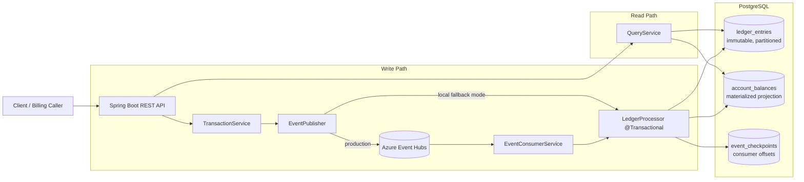
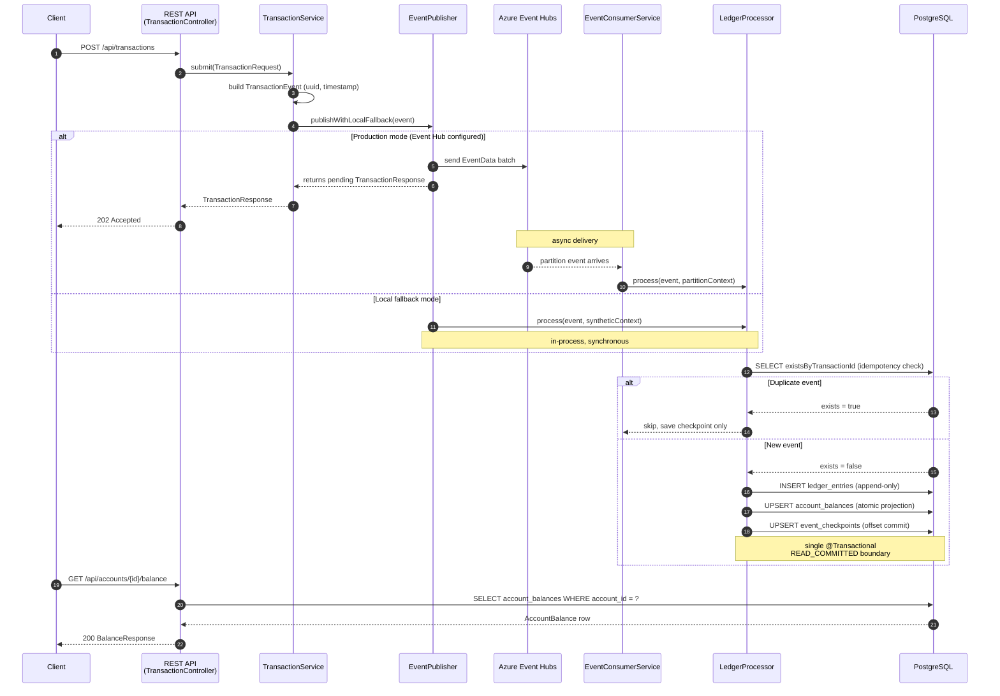

# LedgerFlow

Event-Sourced Billing Ledger built with Java 17, Spring Boot, Azure Event Hubs, and PostgreSQL.

## Overview

LedgerFlow is a billing ledger service that accepts immutable transaction commands (`charge`, `credit`, `refund`, `adjustment`), persists them as ledger events, and exposes query APIs for balances, statements, and aggregated billing reports.

The project combines:
- Event-driven ingestion through Azure Event Hubs
- Transactional projection updates in PostgreSQL
- Idempotent processing and checkpoint persistence
- Fast query access through materialized account balance state

## Core Capabilities

- Submit transaction intents via REST
- Process events exactly once at application level using transaction id checks + checkpoints
- Maintain immutable ledger history in `ledger_entries`
- Maintain query-friendly projection in `account_balances`
- Produce account statement windows and grouped report aggregates
- Support local API validation flows without cloud Event Hub by explicit local fallback mode

## Architecture



## Transaction Lifecycle



## Key Design Decisions

- **Event sourcing** with Azure Event Hubs for durability and replayability
- **Immutable ledger entries** (append-only) for audit compliance
- **Idempotent processing** via unique transaction_id constraint
- **Atomic balance materialization** with PostgreSQL UPSERT
- **Monthly table partitioning** for sub-50ms query performance under high concurrency
- **Exactly-once semantics** via DB-stored checkpoints within the same transaction

## Tech Stack

- Java 17
- Spring Boot 3.2
- Spring Web + Validation + Data JPA
- PostgreSQL 16
- Flyway migrations
- Azure Event Hubs SDK
- Maven build system

## Prerequisites

- Java 17
- Maven 3.9+
- Docker and Docker Compose
- Azure Event Hubs namespace (required for production mode)

## Getting Started

### Local Database Setup

```bash
docker-compose up -d postgres
```

PostgreSQL is exposed on host port `5433` by default in this project.

### Environment Variables

```bash
export EVENTHUB_CONNECTION_STRING="Endpoint=sb://<namespace>.servicebus.windows.net/;SharedAccessKeyName=...;SharedAccessKey=..."
export EVENTHUB_NAME=transactions
export EVENTHUB_CONSUMER_GROUP='$Default'
```

Optional local/dev flags:

```bash
export CONSUMER_ENABLED=true
export EVENTHUB_LOCAL_FALLBACK_ENABLED=false
```

`EVENTHUB_LOCAL_FALLBACK_ENABLED=true` allows local event processing when Event Hub is not configured.

### Build and Run

```bash
mvn clean package -DskipTests
java -jar target/ledgerflow-1.0.0.jar
```

Recommended local run from source:

```bash
DB_HOST=localhost \
DB_PORT=5433 \
DB_NAME=ledgerflow \
DB_USERNAME=ledgerflow_user \
DB_PASSWORD=ledgerflow_pass \
CONSUMER_ENABLED=false \
EVENTHUB_LOCAL_FALLBACK_ENABLED=true \
mvn spring-boot:run
```

## Runtime Modes

- **Production mode**
  - Event Hub configured
  - `EVENTHUB_LOCAL_FALLBACK_ENABLED=false` (default)
  - Writes flow through Event Hub and are consumed asynchronously

- **Local validation mode**
  - Event Hub can be omitted
  - `EVENTHUB_LOCAL_FALLBACK_ENABLED=true`
  - Writes are processed in-process for end-to-end curl testing

## API Endpoints

### Submit Transaction

```
POST /api/transactions
Content-Type: application/json

{
  "accountId": "acct-123",
  "entryType": "charge",
  "amountCents": 1500,
  "currency": "USD",
  "metadata": "{\"description\": \"compute usage\"}"
}
```

Response:

```json
{
        "transactionId": "<uuid>",
        "status": "pending",
        "timestamp": "<iso-8601>"
}
```

### Get Account Balance

```
GET /api/accounts/{accountId}/balance
```

Response shape:

```json
{
        "accountId": "acct-123",
        "balanceCents": -1000,
        "totalCharges": 1500,
        "totalCredits": 500,
        "totalRefunds": 0,
        "transactionCount": 2,
        "updatedAt": "<iso-8601>"
}
```

### Get Account Statement

```
GET /api/accounts/{accountId}/statements?from=2026-01-01T00:00:00Z&to=2026-02-01T00:00:00Z
```

### Get Billing Report

```
GET /api/accounts/{accountId}/reports?from=2026-01-01T00:00:00Z&to=2026-02-01T00:00:00Z
```

## Error Handling

- `400 Bad Request`
  - Bean validation errors (blank account, non-positive amount)
  - Missing required query parameters
  - Invalid datetime/query parameter formats
- `503 Service Unavailable`
  - Event publishing unavailable while local fallback is disabled
- `500 Internal Server Error`
  - Unhandled server-side failures

## Testing

```bash
mvn test
```

## Database Schema

The schema is managed by Flyway migrations. The ledger uses PostgreSQL range partitioning by `created_at` (monthly) to enable partition pruning for time-bounded billing queries.

### Tables

- `ledger_entries` — Append-only immutable audit trail, partitioned by month
- `account_balances` — Materialized balance view, atomically updated with each ledger write
- `event_checkpoints` — Tracks consumed Event Hub sequence numbers for exactly-once processing

## Docker

```bash
docker-compose up --build
```
